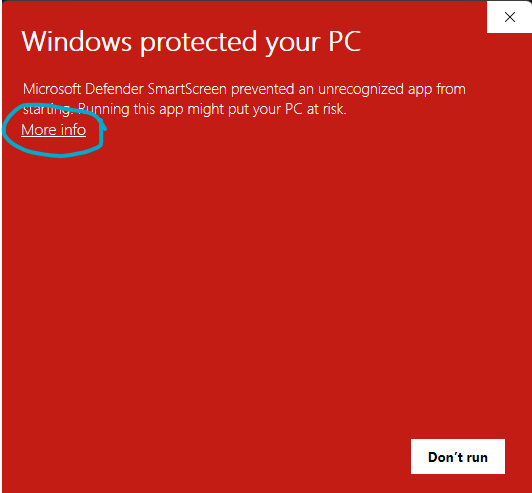
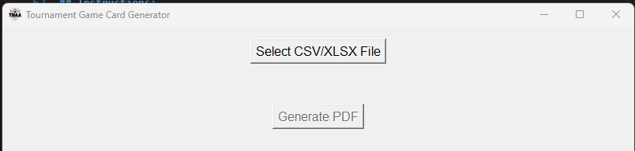

# Tournament Game Card Generator
This tool converts the data in a CSV/XLSX table into a PDF of a tournament's game cards.

**[Download the Tournament Game Card Generator Here!!](https://github.com/karnaph3/TBAAGameCards/releases/download/v0.7/Tournament_Game_Card_Generator.zip)**

## Instructions:
1. Click the above link to download a zip file called `Tournament_Game_Card_Generator.zip`

2. Right-Click on the downloaded folder in your 'Downloads' on your desktop and select `Extract here...`

3. Click into the new `Tournament_Game_Card_Generator` folder (that has been unzipped within your 'Downloads') and then click on the `dist` folder within that one

4. Click on the file called `TBAA_Card_Generator.exe`.
* You may get a pop-up that warns you about this executable! This is expected. Click the "More Info" button and then click the "Run anyway" button that appears.

5. This will open a UI that looks like this:

6. Click on the "Select CSV/XLSX File" button to select the file that contains the game data.

7. In the dropdowns that appear, select which column name *in your file* corresponds to the input it is asking for

8. After all columns have been selected from the dropdown, click "Generate PDF". Enter the file name and decide where you want to save it. 

9. Congrats! You've saved yourself agonizing hours that would've been spent handwriting these cards. 

### **IMPORTANT: You need a CSV or XLSX file with a table containing columns with the following information:**
- Game Number
- Field Number
- Age Group
- Gender
- Game Start Time
- Game Date
- Home Team
- Away Team
- Referee
- Linesman #1
- Linesman #2

Once you confirm you have all the above information, proceed to downloading and running the app.

